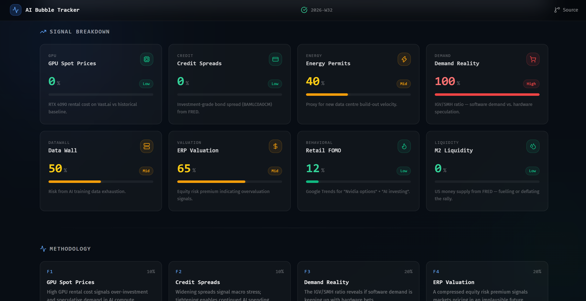
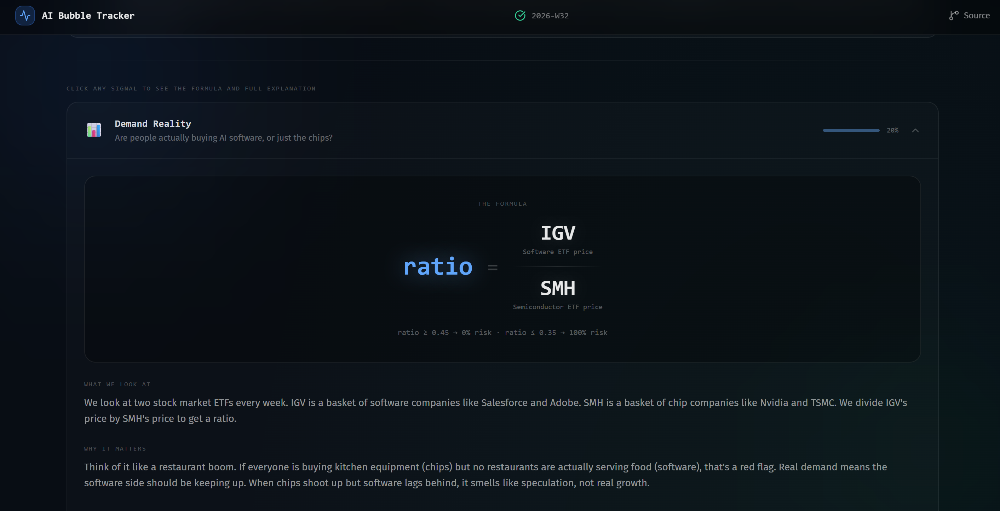

# AI Bubble Tracker

[](https://github.com/gkv856/will-ai-bubble-burst-soon/actions/workflows/update-data.yml)

🔗 **[Live Dashboard](https://will-ai-bubble-burst-soon.vercel.app/)**

An automated, data-driven dashboard tracking macroeconomic signals to determine if the AI investment cycle is in bubble territory.





This project pulls data from public APIs to calculate a 0-100 composite risk score based on 8 key factors — all backed by live data sources, refreshed automatically every week by GitHub Actions. It features a zero-cost data collection pipeline and a premium, dark-mode Next.js dashboard.

## 📊 The 8 Macro Signals

The composite risk score is built by weighting the following factors:

1. **Demand Reality (20%)**: IGV/SMH ETF ratio (Yahoo Finance) — measures if software demand is keeping pace with hardware speculation.
2. **ERP Valuation (20%)**: S&P 500 earnings yield minus the 10-year Treasury yield (Yahoo Finance + FRED) — a compressed or negative premium signals markets pricing in an implausible future.
3. **Retail FOMO (15%)**: Google Trends for "Nvidia options" + "AI investing" via SerpApi — tracks speculative euphoria.
4. **M2 Liquidity (15%)**: US money supply from FRED — tracks the fuel for risk asset rallies.
5. **GPU Spot Prices (10%)**: RTX 4090 rental cost on Vast.ai — signals real compute demand vs supply gluts.
6. **Credit Spreads (10%)**: Corporate bond spreads from FRED — gauges macro stress and lending appetite for capital expenditures.
7. **Energy Costs (5%)**: US retail electricity price from FRED — rising prices signal the grid straining to feed AI data centres.
8. **Data Wall (5%)**: Year-over-year growth in the highest disclosed AI training compute (Epoch AI) — flat or negative growth signals scaling has stalled.

## 🏗️ Architecture

- **Pipeline (`backend/`)**: A modular Python package (`backend/pipeline/`) — one module per factor under `factors/`, shared FRED/scoring helpers under `clients/` and `core/`, and an `orchestrator.py` that composes all 8 scores into a weekly `data.json` entry. Entry point is `backend/main.py`.
- **Dashboard (`frontend/`)**: A Next.js (React) application styled with Tailwind CSS, utilizing Recharts for data visualization and Lucide-react for iconography.
- **Automation (`.github/workflows/update-data.yml`)**: A GitHub Actions workflow runs the pipeline every Wednesday at 9:00 AM IST (and can be triggered manually), commits the refreshed `data.json`, and pushes it — which triggers Vercel to redeploy. Runs entirely on GitHub's servers; no local machine or scheduler needs to stay on.

## 🚀 Setup & Installation

### 1. Data Pipeline Setup (Python)

1. Clone the repository.
   ```bash
   git clone https://github.com/gkv856/will-ai-bubble-burst-soon.git
   cd will-ai-bubble-burst-soon/backend
   ```
2. Create a virtual environment and install dependencies:
   ```bash
   python -m venv venv
   source venv/bin/activate  # On Windows: venv\Scripts\activate
   pip install -r requirements.txt
   ```
3. Get free API keys:
   - [FRED](https://fred.stlouisfed.org/docs/api/api_key.html) (credit spreads, liquidity, energy, valuation)
   - [SerpApi](https://serpapi.com/) (Google Trends / retail FOMO)
4. Copy `.env.example` to `.env` in `backend/` and fill in your keys:
   ```
   FRED_API_KEY=your_key_here
   SERPAPI_KEY=your_key_here
   ```
5. Run the pipeline to generate `data.json`:
   ```bash
   python main.py
   ```
   This writes directly to `frontend/public/data.json` and commits + pushes it. Pass `--no-push` to update the file locally without committing/pushing (useful while testing changes to a factor).

### 2. Dashboard Setup (Next.js)

1. Navigate to the frontend directory:
   ```bash
   cd frontend
   ```
2. Install dependencies:
   ```bash
   npm install
   ```
3. Run the development server:
   ```bash
   npm run dev
   ```
4. Open [http://localhost:3000](http://localhost:3000) with your browser to see the result.

## ⚙️ Zero-Cost Automation

The entire stack runs for free:
- **Data Collection**: `.github/workflows/update-data.yml` runs the pipeline weekly on GitHub's own runners — no server or laptop uptime required.
- **Hosting**: Vercel hosts the Next.js dashboard and redeploys automatically whenever the workflow pushes a new `data.json`.

To enable it on your own fork, add `FRED_API_KEY` and `SERPAPI_KEY` as Actions secrets (repo **Settings → Secrets and variables → Actions**). The workflow already has `contents: write` permission to commit and push using the built-in `GITHUB_TOKEN` — no personal access token needed.

## 🤝 Contributing

Contributions are welcome!

1. Fork the repo and clone your fork.
2. Follow the [Setup & Installation](#-setup--installation) steps above to get the pipeline and dashboard running locally.
3. Create a branch for your change: `git checkout -b feat/your-feature`.
4. Commit your changes and open a pull request describing what you changed and why.

For bigger changes (new factors, scoring methodology, data sources), please open an issue first to discuss the approach.

## ⚠️ Disclaimer

Not financial advice. Educational purposes only. Data sourced from FRED, Yahoo Finance, Vast.ai, Google Trends, and Epoch AI.
